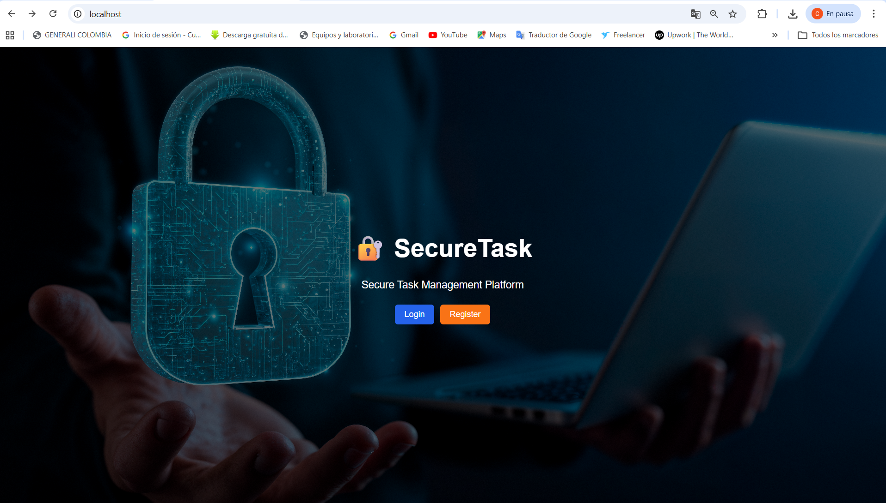
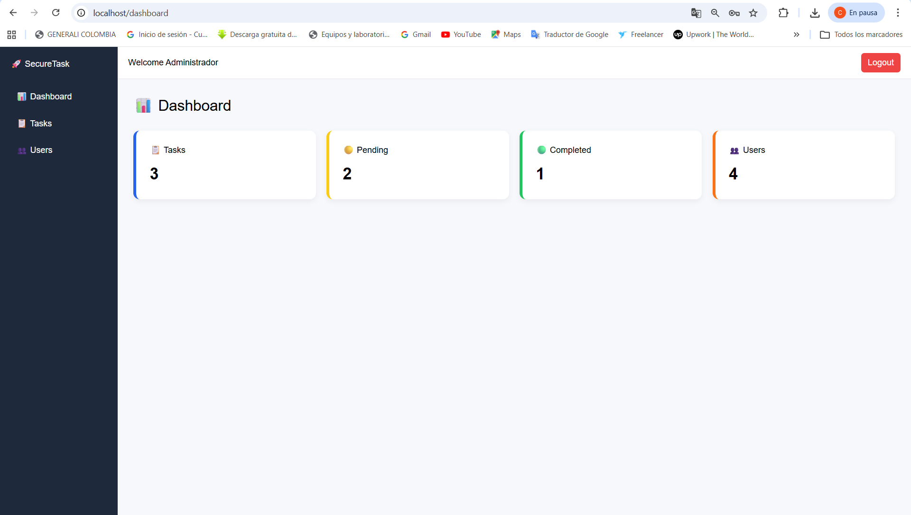
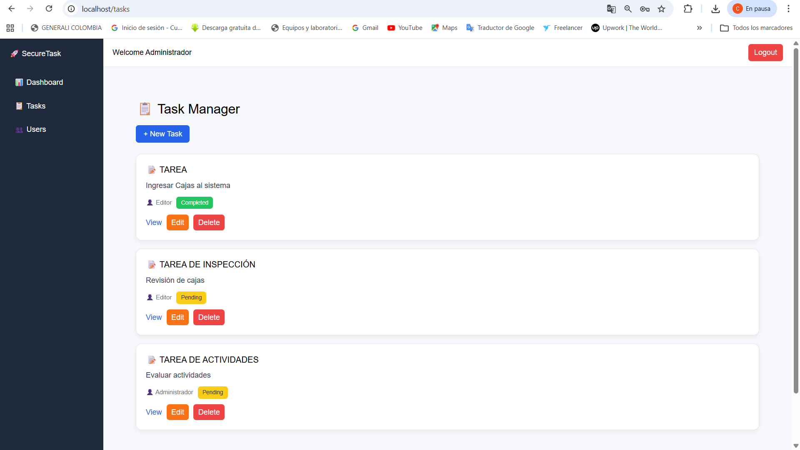
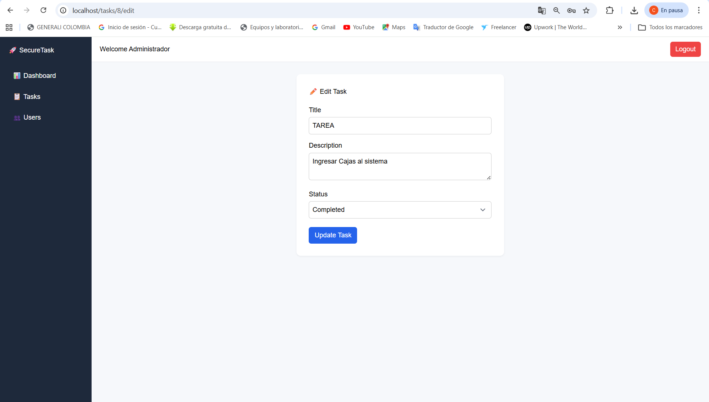
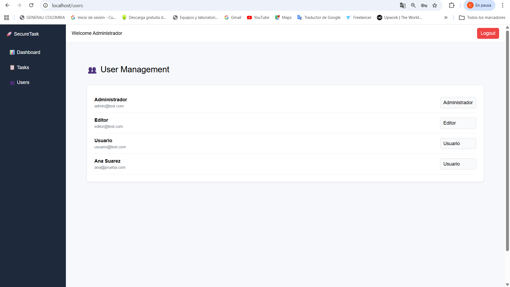
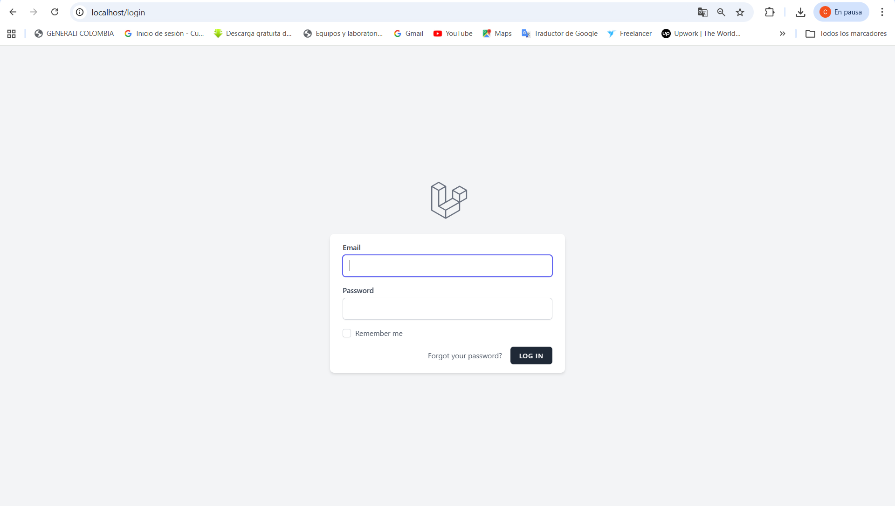
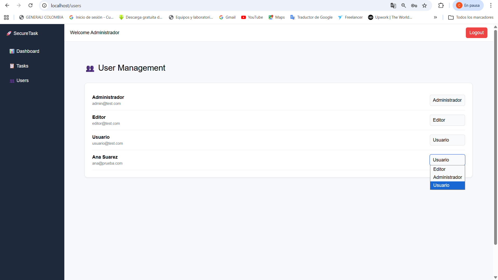

# SecureTask

SecureTask is a secure task management system built with Laravel, React and Inertia.js.  
It includes role-based access control, a modern SaaS-style interface and task management features.

## Tech Stack

- Laravel
- React (Inertia.js)
- Starter-kit de Laravel 12
- Docker (Laravel Sail)
- MySQL
- Spatie Laravel Permission
- Vite
- Javascript
- CSS

## Features

- User authentication
- Role-based access control (Admin, Editor, User)
- Task CRUD system
- Dashboard with statistics
- User management
- Role assignment by administrator
- Modern SaaS-style interface
- Secure access control

## Roles

The system implements three user roles:

### Administrator
- Full CRUD for tasks
- Can view user list
- Can change user roles

### Editor
- Full CRUD for tasks

### User
- Can only view tasks

## Screenshots

### Landing Page

### Dashboard

### Task Manager

### Edit Task

### User Management

### Login

### User Role Management
 

## Instalación

Clonar el repositorio:

git clone https://github.com/CAROLINAMEJIA1106/securetask.git

Run Docker containers:
docker compose up -d

Install dependencies:
docker compose exec laravel.test composer install
docker compose exec laravel.test npm install

Run migrations:
docker compose exec laravel.test php artisan migrate

Start frontend:
docker compose exec laravel.test npm run dev

## Test Users

Administrador
admin@test.com
12345678

Editor
editor@test.com
password

Usuario
usuario@test.com
password

Ana Suarez
ana@prueba.com
password

## Assets

Background image: Image by Freepik  
https://www.freepik.com
